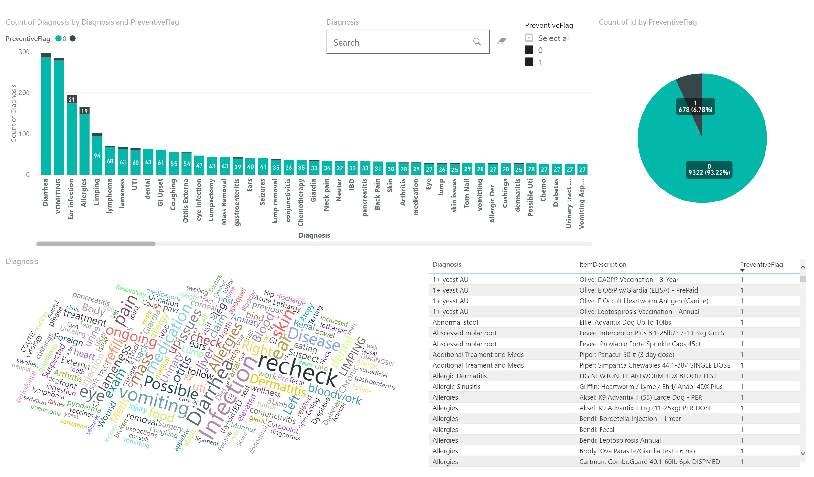
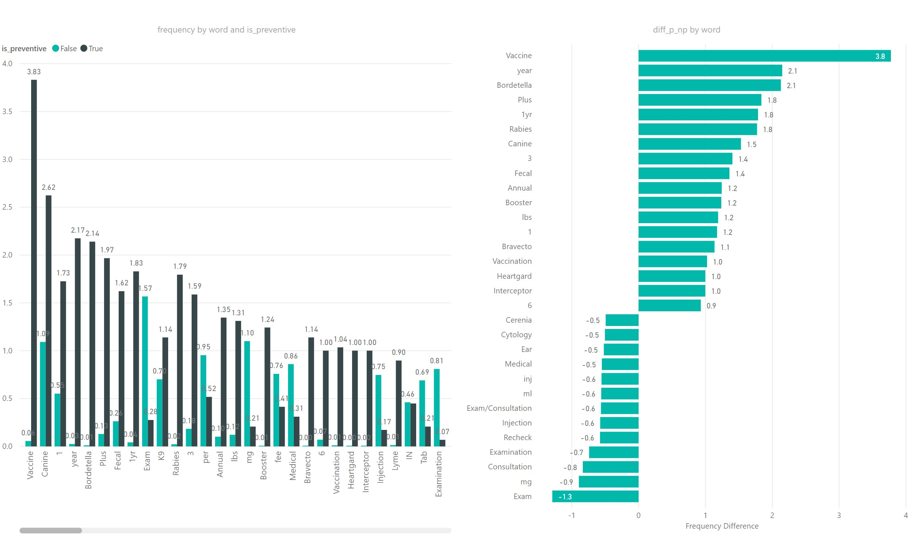

## Description
When we recevie invoice data from our customers, it is structured by line item. Our product does not cover routine, wellness or preventive care. We believe that costs that pet owners can expect periodically and budget for should be separate from an insurance policy meant to cover accidents and illnesses.

Use the data contained in p2_data.csv to build a binary classifier to predict the “PreventiveFlag” label using the text features provided. This model can be used to automate the detection of ineligible line items. The expected output are prediction probabilities for rows 10001 through 11000, where the labels are currently null.

## Implementation Details
* Used TorchText to preprocess the text and transform it into GloVe vectors 

* Implemented TextCNN and trained with PyTorch on a 10K records to identify whether the receipt item is preventive and achieved 0.98 accuracy

* Completed the visulization with Power BI

### Files information
The original files are put into the folder './Original'

The solutions are located inside './Solution' folder, there you can find:

* p1_solution.csv

  This file has the mapping from id_lineitem to id_labeled

* p2_data_solved.csv

  This file has the model predicted labels for the last 1000 records

* 'Build a text classifier.ipynb'

  For this problem, I've used Power BI to explore the data, you'll find two figures inside this file, I've trained a Text CNN deep learning model to predict the labels, the trained model checkpoint is saved under './Chkpt' folder.

 
 