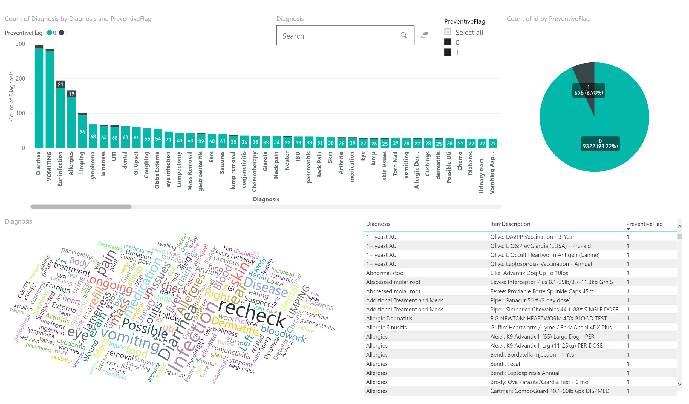
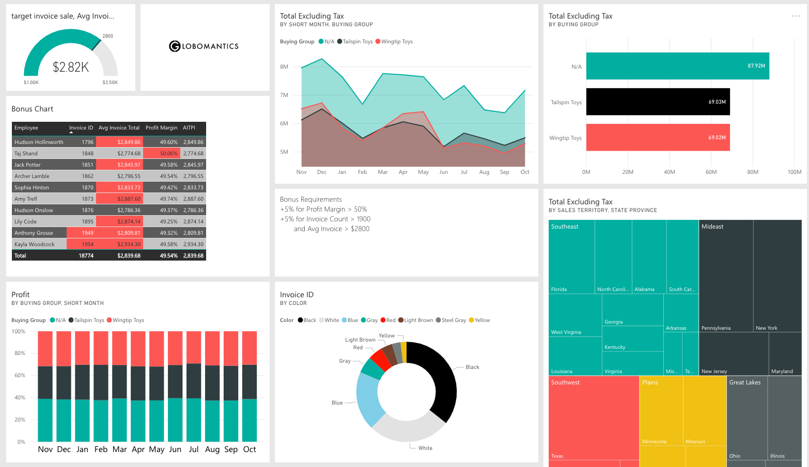
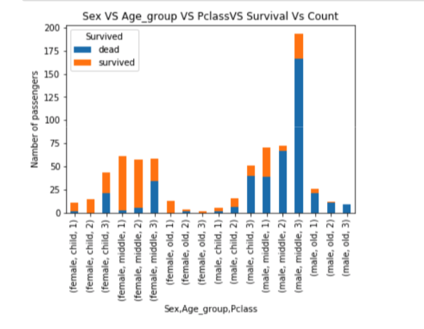
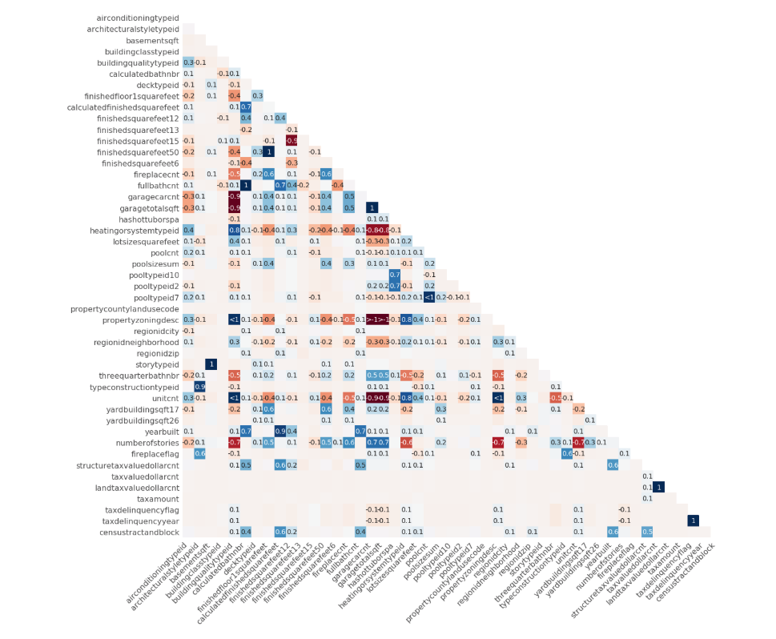

# Data analysis project

## Pet Insurance
### Implementation Details
* Used TorchText to preprocess the text and transform it into GloVe vectors 

* Implemented TextCNN and trained with PyTorch on a 10K records to identify whether the receipt item is preventive and achieved 0.98 accuracy 

* Completed the visulization with Power BI

## Power BI Report
This a dashboard shows sales profit according to employees and different sales territories. 

## Titanic analysis

## Zillow Home Value Prediction

- Imported and cleaned the house price dataset with 300k records
- Used missingno to explore and visualized the missing value 
- Trained with XGBoost and dealt with correlation analysis
- Explored variables with multicollinearity analysis and univariate analysis

