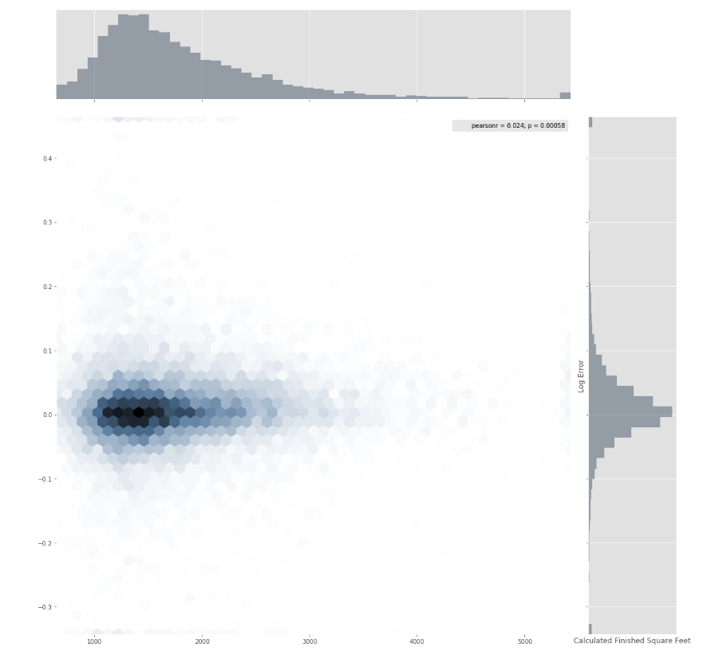

# Data analysis project

## Pet Insurance
* Used TorchText to preprocess the text and transform it into GloVe vectors 
* Implemented TextCNN and trained with PyTorch on a 10K records to identify whether the receipt item is preventive and achieved 0.98 accuracy 
* Completed the visulization with Power BI

## Power BI Report
This a dashboard shows sales profit according to employees and different sales territories. 

## Titanic analysis
- Imported and cleaned the Titanic passengers dataset with 891 records.
- Explored the dataset, created visualisations with matplot to demonstrate distributions of survivors based on rate, age, sex, ticket class, embark port, etc.
- Analysed the dataset based on the visualisations, inference facts about the datasets.

## Zillow Home Value Prediction

- Imported and cleaned the house price dataset with 300k records
- Used missingno to explore and visualized the missing value 
- Trained with XGBoost and dealt with correlation analysis
- Explored variables with multicollinearity analysis and univariate analysis

