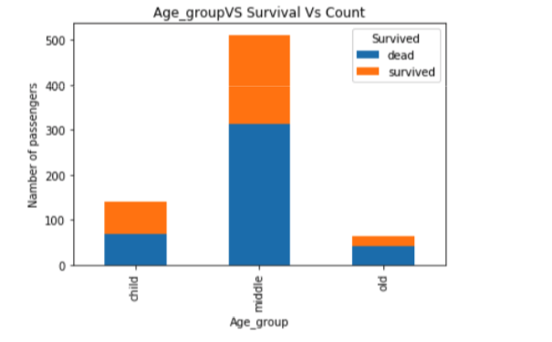
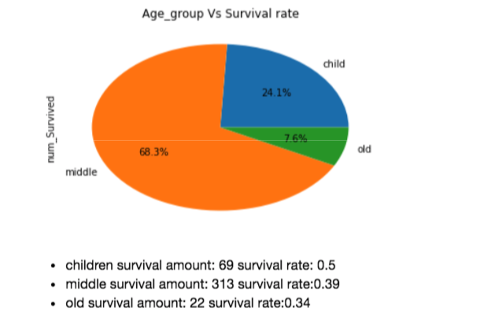
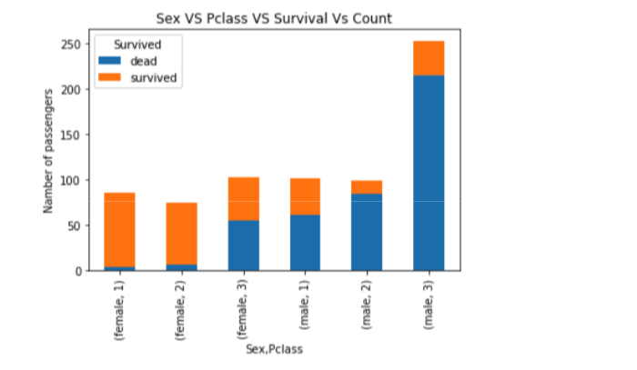
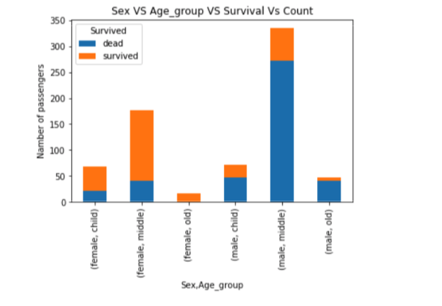

# Project: Titanic Survival Exploration
## Jupyter Notebook, python, numpy, pandas, Matplotlib, EDA
## Introduction
The sinking of the RMS Titanic is one of the most infamous shipwrecks in history. On April 15, 1912, during her maiden voyage, the Titanic sank after colliding with an iceberg, killing 1502 out of 2224 passengers and crew. This sensational tragedy shocked the international community and led to better safety regulations for ships.

One of the reasons that the shipwreck led to such loss of life was that there were not enough lifeboats for the passengers and crew. Although there was some element of luck involved in surviving the sinking, some groups of people were more likely to survive than others, such as women, children, and the upper-class.

This notebook presents a profound exploratory analysis of the dataset in order to provide understanding of the dependencies and interesting facts. We will then use these dependencies to create several models that will be able to predict whether a person survived the shipwreck or not. We will analyse these models and find out the best among them.

## Questions:
 - Did men give more opportunities for survival to women?
 - Were social-economic standing a factor in survival rate?
 - What is the relationship between passenger age and survival?

## Conclusions:
- Female has a much higher survival rate than male (74% vs 19%).
- Higher ticket class also means higher survival rate (With class 1 of 64% vs class 3 of 24%)
- Senior Female has the highest survival rate among females, while senior male the opposite.
- 54% of the survivors are children.

