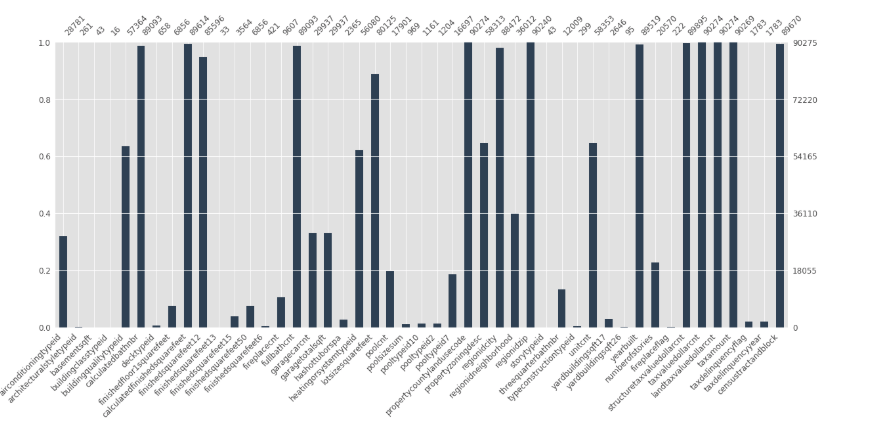
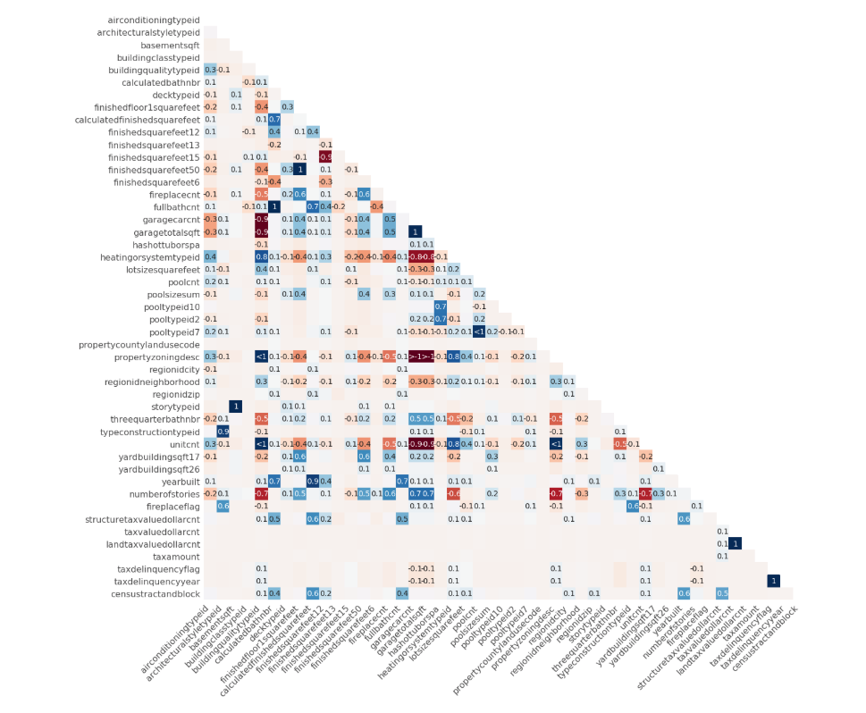
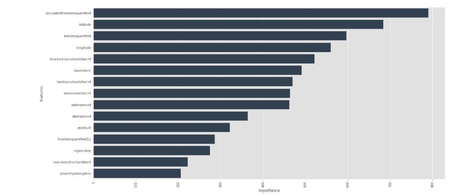
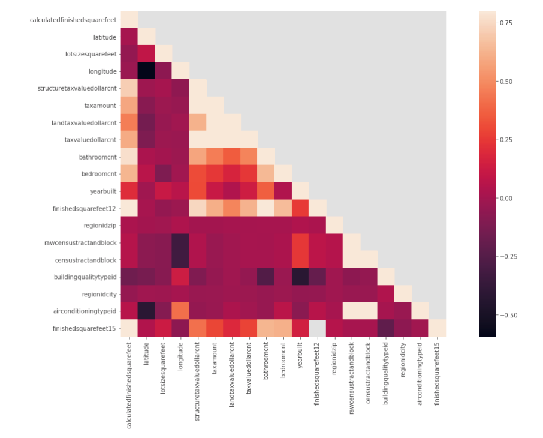
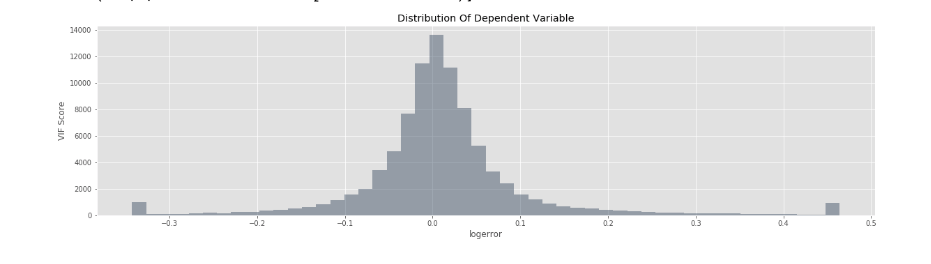
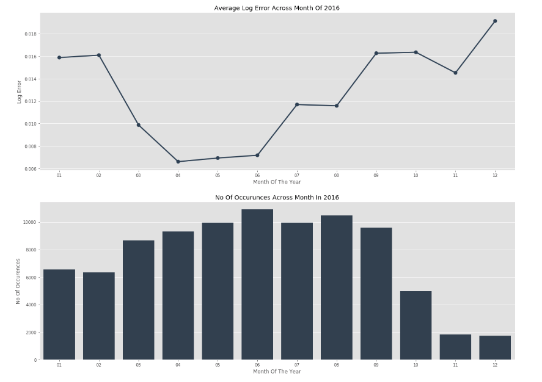
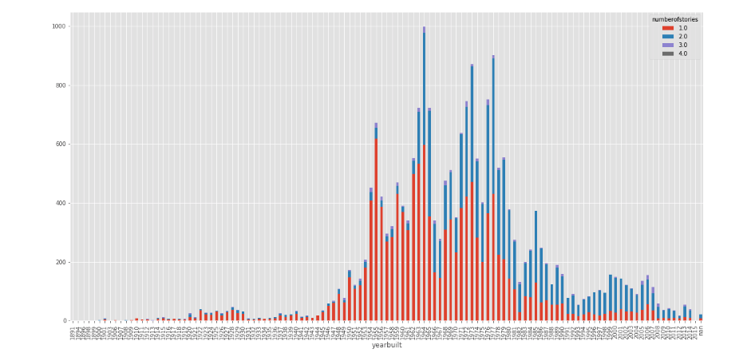
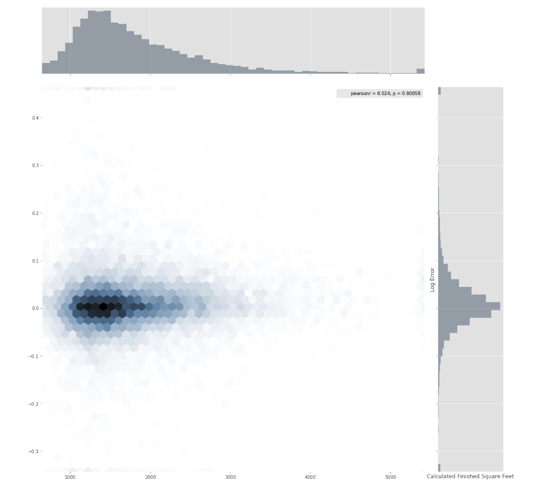
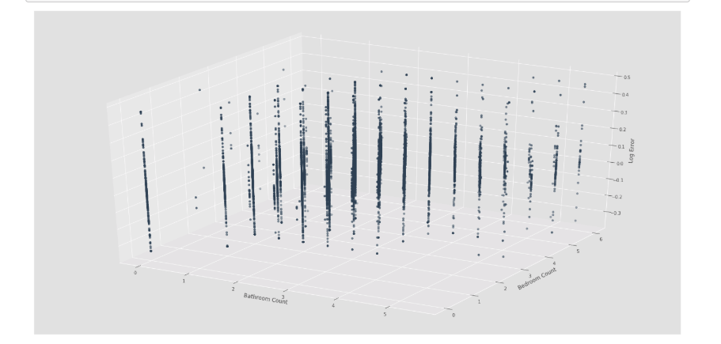

# Zillow Real-Estate Exploratory Data Analysis
##Jupyter Notebook, python, EDA, XGBoost, time series, seaborn, missingno, numpy, pandas

evaluated on Mean Absolute Error between the predicted log error and the actual log error. The log error is defined as： 

**logerror=log(Zestimate)−log(SalePrice)**

It is recorded in the transactions training data. If a transaction didn't happen for a property during that period of time, that row is ignored and not counted in the calculation of MAE.

- Imported and cleaned the house price dataset with 300k records
- Used missingno to explore and visualized the missing value 
- Trained with XGBoost and dealt with correlation analysis
- Explored variables with multicollinearity analysis and univariate analysis

 
 
 
 
 
 
 
 
 